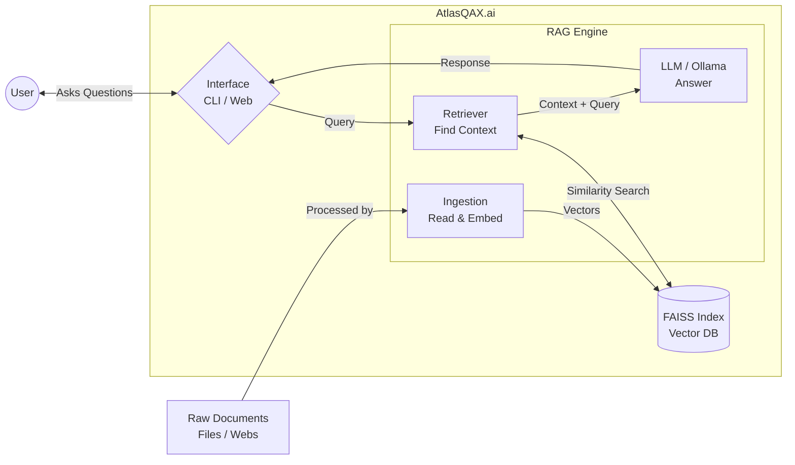

# AtlasQAX.ai


AtlasQAX.ai is a project created for **learning purposes**, specifically to explore and understand the basics of Retrieval-Augmented Generation (RAG) and the [LangChain](https://python.langchain.com/) framework. It is an intelligent Question Answering system that delivers **accurate, explainable answers** from multiple data sources.  
Starting with document-based knowledge retrieval, it is designed to scale towards **databases, APIs, and Microsoft Dataverse** integration.

By combining QA, X (Explainability), and AI, AtlasQAX.ai aims to become a data companion that not only answers but also helps you **understand and interpret** the information it provides.

## Table of Contents
- [Project Status](#project-status)
- [Key Features](#key-features)
- [Architecture](#architecture)
- [Quick Start (with Makefile)](#quick-start-with-makefile)
- [Manual Execution Guide](#manual-execution-guide)
- [Available Commands](#available-commands)
- [Tech Stack & Libraries](#tech-stack--libraries)

---
## Project Status
AtlasQAX.ai is currently in an early development phase.
The basic functionality—document ingestion and natural language Q&A—is already working, but many planned features are still in progress.

A lot of improvements can be made in areas such as document ingestion, embeddings generation, and retrieval quality, which are active focus points for future updates.

Over the coming iterations, the project will expand to include:
- More robust multi-language support
- Enhanced explainability and audit logging
- Database and API connectors
- Improved interfaces (streamlined web UI, better CLI experience)
- Performance optimizations for larger document sets
- Better model/rag tuning workflows

This repository is actively evolving, and the roadmap involves significant improvements in both functionality and usability. Contributions, feedback, and ideas are welcome!

---
## Key Features
- **Natural Language QA** → Ask questions in plain language.  
- **Explainable AI** → Get not only answers, but also transparent reasoning.  
- **Multi-source Integration** → From unstructured documents, web pages and structured data platforms.  
- **Scalable Design** → Flexible architecture to grow with your data needs.  
- **Multiple Interfaces** → Choose between CLI and web interface (Streamlit).

---
## Architecture



---
## Quick Start (with Makefile)

We provide a `Makefile` to simplify standard operations locally using Docker and Pipenv.

1. **Install dependencies:**  
   ```bash
   make install
   ```

2. **Start the app and Ollama (background):**  
   ```bash
   make start
   ```  
   *Note: This starts the Docker compose stack for Ollama and launches the Streamlit app. Open `http://localhost:8501` to use the web interface.*

3. **Check status:**  
   ```bash
   make status
   ```

4. **Ingest documents:**  
   ```bash
   make ingest
   ```

5. **Run CLI interactive mode:**  
   ```bash
   make cli
   ```

6. **Stop the app and Ollama:**  
   ```bash
   make stop
   ```

---
## Manual Execution Guide

If you prefer running commands manually or without Docker, follow these steps. AtlasQAX.ai runs as a Python app + FAISS index, and **requires an Ollama server** for the LLM and (by default) embeddings.

### 1) Prerequisites

#### Python
- Python **3.12** (as declared in `Pipfile`)

#### System packages (Linux)
```bash
sudo apt-get update
sudo apt-get install -y libmagic-dev poppler-utils tesseract-ocr libreoffice tesseract-ocr-spa tesseract-ocr-cat
```

#### Python dependencies
From the project root:
```bash
pip install -r requirements.txt
```
or
```bash
pipenv install
```

### 2) Configure environment

Create your `.env` from the template:
```bash
cp .env.example .env
```

Default `.env.example` already points to:
- `OLLAMA_MODEL=llama3.1:8b`
- `EMBEDDINGS_BACKEND=ollama`
- `EMBEDDINGS_MODEL=bge-m3`

### 3) Start Ollama (required)

#### Option A — Native Ollama (no Docker)
Install Ollama and start server:
```bash
ollama serve
```
In another terminal, pull models used by default config:
```bash
ollama pull llama3.1:8b
ollama pull bge-m3
```

#### Option B — Docker Ollama
The provided `docker-compose.yml` starts an Ollama container and auto-pulls `llama3.1:8b` and `bge-m3`.
```bash
docker compose up -d
docker logs -f ollama
```

Stop it with:
```bash
docker compose down
```

> Note: current compose is configured with NVIDIA GPU reservation. If you don't have NVIDIA container runtime configured, use native Ollama or adjust compose accordingly.

### 4) Ingest documents

Add files to `data/files/` (or set paths in `data/docs_paths.txt` / URLs in `data/webs_paths.txt`), then run:
```bash
python -m atlasqaxai ingest
```

### 5) Run AtlasQAX.ai

#### CLI
```bash
# Interactive Q&A mode (default)
python -m atlasqaxai

# One-shot question
python -m atlasqaxai ask "What is the main topic of the documents?"

# Management commands
python -m atlasqaxai summary
python -m atlasqaxai inspect
python -m atlasqaxai rebuild
python -m atlasqaxai wipe
```

#### Web app (Streamlit)
```bash
python -m atlasqaxai app
```
Then open: `http://localhost:8501`

### 6) Quick health checks

- Ollama reachable: `ollama list` (or `docker logs -f ollama`)
- Index created: `index/index.faiss` and `index/index.pkl`
- Summary available: `python -m atlasqaxai summary`

### Important runtime note

Run commands from the **repository root** so paths like `atlasqaxai/ui/streamlit_app.py` and relative data/index paths resolve correctly.

---
## Available Commands
### Data Management
- **`ingest`** - Index new or changed documents from your `data/files/` directory
- **`rebuild`** - Completely rebuild the index from scratch (useful after configuration changes)
- **`wipe`** - Delete the entire index (requires confirmation)

### Information & Inspection
- **`summary`** - Show a user-friendly summary of documents in the index with chunk counts
- **`inspect`** - Display detailed technical information about the index structure

### Question Answering
- **`ask`** - Ask questions about your documents (interactive mode by default)

### Web Interface
- **`app`** - Launch the Streamlit web interface

---
## Tech Stack & Libraries
### Core Orchestration
- **LangChain** — High-level framework to compose LLM/RAG pipelines (load → split → embed → retrieve → generate).  
  Docs: [python.langchain.com](https://python.langchain.com) · GitHub: [langchain-ai/langchain](https://github.com/langchain-ai/langchain)

<!-- - **langchain-community** — Community integrations (document loaders, vector stores, retrievers) used by the project.  
  PyPI: [langchain-community](https://pypi.org/project/langchain-community/) · Source: [monorepo packages](https://github.com/langchain-ai/langchain/tree/master/libs)

- **langchain-ollama** — LangChain bindings for **Ollama**: `ChatOllama` (LLM) and `OllamaEmbeddings` (local embeddings).  
  Docs: [Ollama in LangChain](https://python.langchain.com/docs/integrations/llms/ollama) · PyPI: [langchain-ollama](https://pypi.org/project/langchain-ollama/) -->

### Text Processing
<!-- - **langchain-text-splitters** — Robust chunking utilities (e.g., `RecursiveCharacterTextSplitter`) to keep context coherent.  
  Docs: [Text splitters](https://python.langchain.com/docs/how_to#text-splitters) · PyPI: [langchain-text-splitters](https://pypi.org/project/langchain-text-splitters/) -->

- **pypdf** — PDF parsing/extraction used by the PDF loader.  
  Docs: [pypdf.readthedocs.io](https://pypdf.readthedocs.io/) · PyPI: [pypdf](https://pypi.org/project/pypdf/)

- **python-docx** — DOCX reader to extract text from Word documents.  
  Docs: [python-docx.readthedocs.io](https://python-docx.readthedocs.io/) · PyPI: [python-docx](https://pypi.org/project/python-docx/)

### Embeddings & Retrieval
- **FAISS (faiss-cpu)** — Fast vector index for similarity search; persisted locally in `index/`.  
  GitHub: [facebookresearch/faiss](https://github.com/facebookresearch/faiss) · PyPI: [faiss-cpu](https://pypi.org/project/faiss-cpu/)

<!-- - **sentence-transformers** *(optional)* — Local embedding & reranking models (e.g., `all-MiniLM-L6-v2`, `BAAI/bge-small-en-v1.5`).  
  Website: [sbert.net](https://www.sbert.net/) · PyPI: [sentence-transformers](https://pypi.org/project/sentence-transformers/) -->

### Local LLM Runtime
- **Ollama** — Local model runner that serves chat models (e.g., Llama 3) and embedding models (e.g., `nomic-embed-text`) entirely offline.  
  Site: [ollama.com](https://ollama.com) · Models: [ollama.com/library](https://ollama.com/library)

### Configuration & Utilities
- **python-dotenv** — Loads settings from `.env` (e.g., model names, chunk sizes) to keep code clean and configurable.  
  PyPI: [python-dotenv](https://pypi.org/project/python-dotenv/)

### Web Interface
- **Streamlit** — Modern web framework for creating interactive data applications with Python.  
  Site: [streamlit.io](https://streamlit.io) · PyPI: [streamlit](https://pypi.org/project/streamlit/)

---

## Notes
- **Ollama is mandatory** for the current default setup (`ChatOllama` + `OllamaEmbeddings`).
- **Local-only by default:** AtlasQAX.ai can run fully offline once models are pulled.
<!-- - **Swap components easily:** You can switch embeddings (Ollama ↔︎ Sentence-Transformers) or vector stores (FAISS ↔︎ others) with minimal code changes. -->
<!-- - **Incremental ingestion:** The structure supports hashing & manifests so you only re-embed changed files. -->

---
## Contributing & License

Contributions, issues, and feature requests are always welcome! Since this is a learning-focused project, any ideas on improving the ingestion pipeline, expanding the vector store modules, or fine-tuning the LLM prompts are greatly appreciated.

*This project is currently provided for learning and exploration purposes.*
